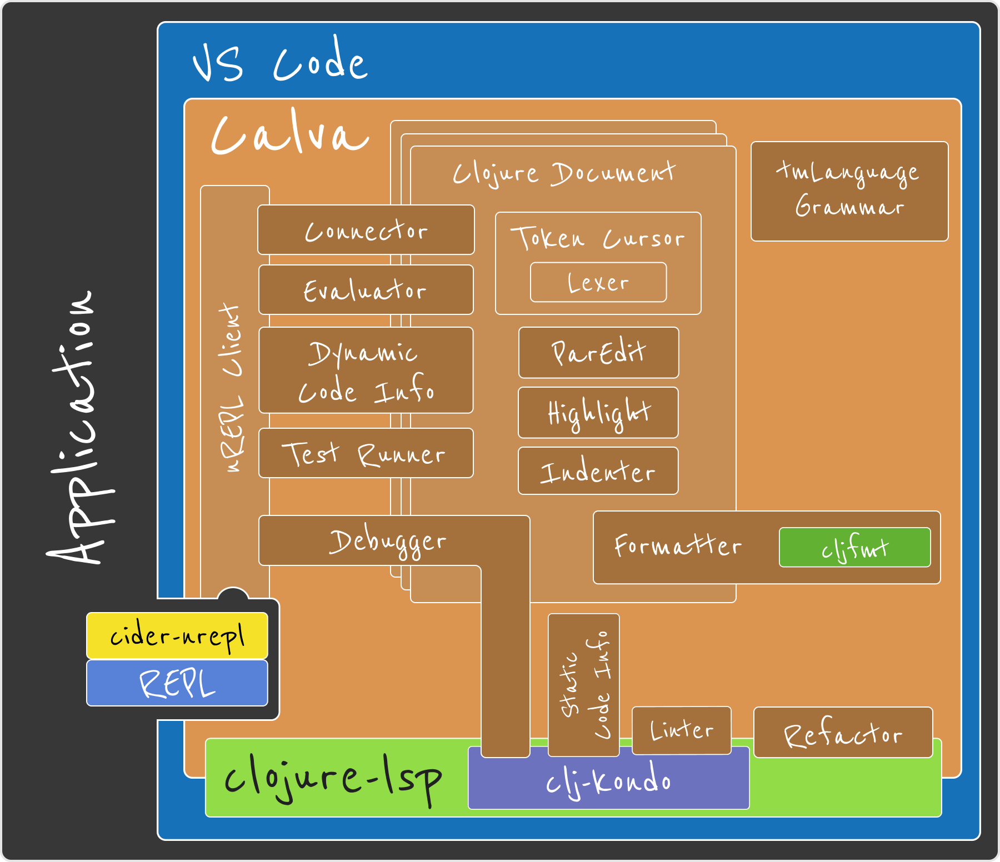

# 

  

My favorites: VS Code and Clojure

Calva was released March 16 2018  🎉

* Actively developed. Bus Factor: 2
* Connects the editor to the running application's REPL - **Interactive programming**
  * Custom REPL-commands
* Structural editing
* Syntax highlight
  * Rainbow 🌈 brackets and vertical guides
  * Structural comments
* Formatting
* Pretty printing
* Code documentation and navigation - including libraries, including Java
* Debugger
* Test runner
* Linter
* Refactoring
* Unique for Calva: Getting Started REPL – https://calva.io/getting-started

  

  

    
  

---

[Start](hello.md) > [Clojure](clojure.md) > [REPL](repl.md) > [Calva](calva.md) > [ClojureScript](cljsrn.md) > [Moar?](moar.md)