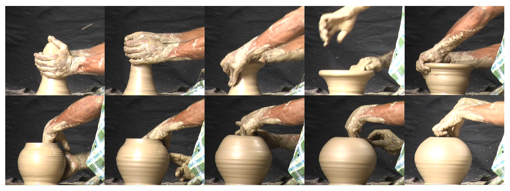

# The Clojure REPL

  

## Interactive Programming

* Connected to the running app
  * Modify the app as it is running
  * Develop and test each building block
    * Iterate
  * No restarting
  * Plugged in to you editor

  

  

    

        
        
    

    
  

---

[Start](hello.md) > [Clojure](clojure.md) > [REPL](repl.md) > [Calva](calva.md) > [ClojureScript](cljsrn.md) > [Moar?](moar.md)